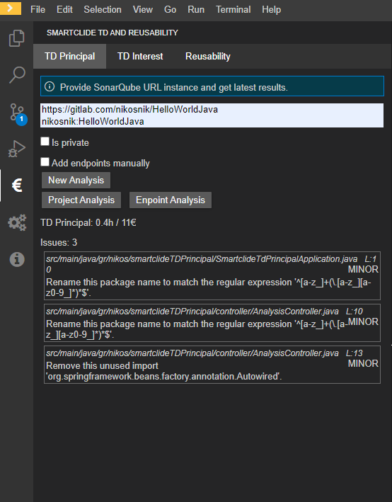
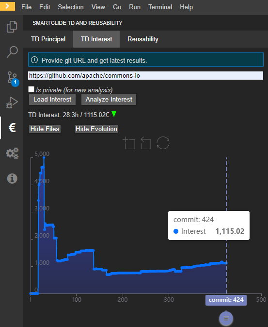
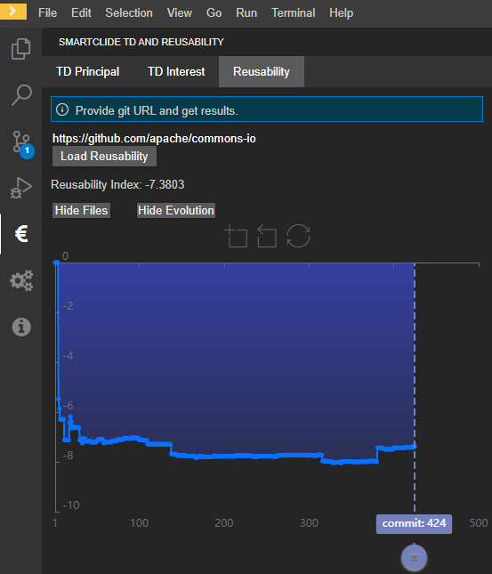

# Smartclide TD & Reusability
SmartCLIDE TD Principal-Interest & Reusability Frontend Component

## Usage

The user can access this extention from the tab View - SmartClide TD and Reusability.
From the user can see the extension in the left side of the editor.
From here the user is able to see the following 3 different categories:
- TD Principal
- TD Interest
- Reusability

### TD Principal 

In the first tab of the extension namely "TD Principal", the used is able to see the Principal in hours and monetary values, along with the actual inefficiencies.
- The user should provide the Project Url, which is the git url of the project.
- The "SonarQube Project Key" is a key that is used in SonarQube, which is an automatic generated value in the following format {projectOwner}:{projectName}
- The “Git Token” if it’s a private project
- And if the user wants they can provide specific endpoints for analysis.

If there is already a Analysis of this project, the user can get the Project Analysis or Endpoint Analysis with the according buttons. If there isnt an Analysis, the user should perform a New Analysis first.

You can see the following example for reference. It should be noted, that a lot of this fields could be removed in the next versions since we have in other places the majority of the info.




### TD Interest

In the second tab namely "TD Interest", the user can provide the following:
- The Project Url, which is the git url of the project
- The “Git Token” if it’s a private project

If there is already an interest analysis the used can get it, through the "Load Interest" button. Or if there are new commits they can select "Analyze Interest" in order to get up to date.

|              Files               |              Evolution               |
|:-------------------------------------:|:-----------------------------------:|
|  |  |

### Reusability

In the final tab, the user should provide the Project Url, and given the Interest Analysis that have already been made, the reusablity values are calculated.

|              Files               |              Evolution               |
|:-------------------------------------:|:-----------------------------------:|
|  |  |

<br/>

## Build and Run

### Preconditions to build and run

To build and run the frontend of TD Principal-Interest & Reusability, the following software is required:

- Python
- Node.js with visual studio build tools (this can be selected in the optional tools during the node.js installation or after hand in several ways, ex. with npm, or with visual studio installer)
- Yarn package manager npm install --global yarn


### How to build TD Principal-Interest & Reusability Frontend

TD Principal-Interest & Reusability Frontend can be built using the following command:

```shell
yarn
```

### How to run TD Principal-Interest & Reusability Frontend

After building the theia extension, you can start a local instance of theia with our extension.

### Running the browser example

```shell
yarn start:browser
```

*or:*

```shell
yarn rebuild:browser
cd browser-app
yarn start
```

*or:* launch `Start Browser Backend` configuration from VS code.

Open http://localhost:3000 in the browser.
